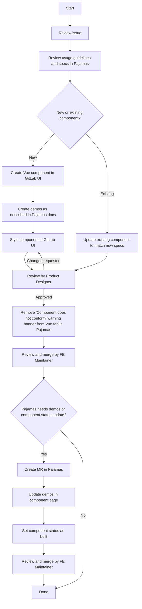

# Building and styling a component

**Note**: If you are building or styling a component not documented in
[https://design.gitlab.com](https://design.gitlab.com), feel free to skip this diagram and follow
the [guidelines to adding a new component to GitLab UI](contributing/adding_components.md).

A component follows the [lifecycle defined in the
Pajamas repository](https://design.gitlab.com/contribute/lifecycle).

The following diagram outlines the steps needed to complete the build and style
stages of a component:

## Viewing changes in Pajamas

When a change to GitLab UI is made, it will not be reflected in
[Pajamas](https://gitlab.com/gitlab-org/gitlab-services/design.gitlab.com) until
the package is updated. See [Updating Gitlab Packages](./updating-gitlab-ui-packages.md) for details.

# Component status

Not all components within GitLab UI are fully integrated within the GitLab product at this 
time. Some components may be partially integrated and others have been migrated 
from [GitLab](https://gitlab.com/gitlab-org/gitlab) to [GitLab UI](https://gitlab.com/gitlab-org/gitlab-ui). 
To view which components have been fully integrated into the product, view our 
[component status page](https://design.gitlab.com/components/status) within Pajamas.

GitLab UI components should be used within GitLab even if they do not yet fully 
conform to design specs.

## Complex components

There are a few cases where components have been migrated from GitLab to
GitLab UI but do not yet reflect Pajamas documentation. When a complex component
is difficult to style or update because many features use it, we recommend creating a migration plan and coordinating with the [Gitlab UI Working Group](https://about.gitlab.com/company/team/structure/working-groups/gitlab-ui/) on its rollout.

In the past, a `New` version of the component has been created to allow the team to build and style the component according to design specs without causing inadvertent side effects to features
that are already using the migrated Vue component.

However, this has led to confusion about which components to use; technical debt involved in migrating the component and not allowing them both to flourish; and follow-on effects keeping other complex components up-to-date. Until there is an officially determined path, we recommend coordinating a plan with the wider group.
