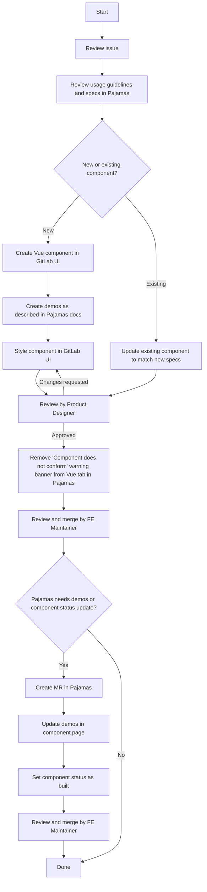

# Building and styling a component

**Note**: If you are building or styling a component not documented in
[https://design.gitlab.com](https://design.gitlab.com), feel free to skip this diagram and follow
the [guidelines to adding a new component to GitLab UI](contributing/adding_components.md).

A component follows the [lifecycle defined in the
Pajamas repository](https://gitlab.com/gitlab-org/gitlab-services/design.gitlab.com/blob/master/doc/component-lifecycle.md).

The following diagram outlines the steps needed to complete the build and style
stages of a component:

## Updating GitLab Packages

When a change to GitLab UI is made, it will not be reflected in
[Pajamas](https://gitlab.com/gitlab-org/gitlab-services/design.gitlab.com) until
the package is updated. We are using [Renovate GitLab Bot](https://gitlab.com/leipert-projects/renovate-gitlab-bot)
to automate this process.

Once an MR is created to bump the version, it will need to be merged into both [Pajamas](https://gitlab.com/gitlab-org/gitlab-services/design.gitlab.com) and [GitLab](https://gitlab.com/gitlab-org/gitlab).

For Pajamas, once the generated MR is approved, Renovate GitLab Bot will automatically merge the update. At this time, the changes should be viewable on the Pajamas site.

For Gitlab, the MR needs to be merged by a maintainer.

# Component status

Not all components within GitLab UI are used in the GitLab product at this
time. However, some components have been implemented and others have been migrated
from [GitLab](https://gitlab.com/gitlab-org/gitlab) to
[GitLab UI](https://gitlab.com/gitlab-org/gitlab-ui).
To view which components have been implemented into the product, view our
[component status page](https://design.gitlab.com/components/status) within Pajamas.

## Complex components

There are a few cases where components have been migrated from GitLab to
GitLab UI but do not yet reflect Pajamas documentation. When a complex component
is difficult to style or update because many features use it, a `New` version of
the component may be created. This allows the team to build and style the component
according to design specs without causing inadvertent side effects to features
that are already using the migrated Vue component.

For example, see [GlButton](https://gitlab-org.gitlab.io/gitlab-ui/?path=/story/base-button--default)
vs. [GlNewButton](https://gitlab-org.gitlab.io/gitlab-ui/?path=/story/base-new-button--default)
