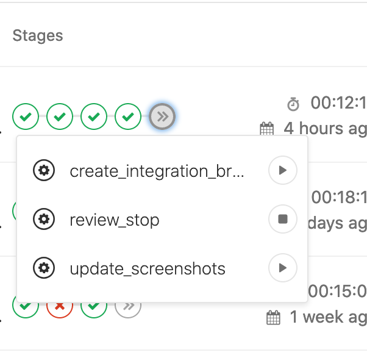

# Adding a new component to GitLab UI

The following provides guidance for engineers adding new components to GitLab UI.

## General guidelines

You should use `yarn generate:component` to begin your component implementation.
This scaffolding tool generates the file structure required by GitLab UI for every component.
It also:

- Exposes the component in GitLab UI's main entry point file.
- Registers the component’s documentation.
- Imports the component’s stylesheet in GitLab UI’s default CSS bundle.

You can choose between two templates: _Create Component_ or _Wrap BootstrapVue Component_.

### Merge Request guidelines

Create a Merge Request in GitLab UI with your new component code. The Merge Request should follow
these conventions:

- Name your MR `feat([ComponentName]): Implement [ComponentName] component`. This creates a conventional commit used by the [npm release CI job](https://gitlab.com/gitlab-org/gitlab-ui/pipelines) to create a new version of the GitLab UI package.
- Check the _Squash commits when merge request is accepted_ option in the Merge Request edit page.

Run the manual CI job (`update_screenshots`) to generate the baseline snapshots used by the visual
tests. You can find it in last stage of
[GitLab UI CI pipeline](https://gitlab.com/gitlab-org/gitlab-ui/pipelines).
This CI job commits the baseline snapshot images to the merge request branch.

## Working on a Pajamas-documented component

If you are adding or updating a component documented in the
[Pajamas design system](https://design.gitlab.com), you should comply with the
[component lifecycle workflow](../component-lifecycle.md).

## Wrapping a BootstrapVue component

Use `yarn generate:component` to quickly generate a
[BootstrapVue](https://bootstrap-vue.js.org/) component wrapper in GitLab UI using
the _Wrap BootstrapVue Component_ template. After using the template, follow the same
instructions described in the general guidelines.

## Testing your new component in GitLab

You can test your new component in [GitLab](https://gitlab.com/gitlab-org/gitlab) before a
new version of GitLab UI is released. There are several reasons to do that, such as addressing breaking
changes introduced by the component.

After creating the new component’s Merge Request and the CI pipeline passes, run the
`create_integration_branch` [manual CI job](https://gitlab.com/gitlab-org/gitlab-ui/pipelines). This job creates or updates a branch in
[GitLab](https://gitlab.com/gitlab-org/gitlab) and replace the stable version of GitLab UI in
the master branch with the package built by the `build_package` CI job in the new component
Merge Request. You would then only need to create a new Merge Request from that branch by
following the link at the end of the `create_integration_branch` job's output.

Once you create the GitLab integration Merge Request, create a note in the GitLab UI Merge Request with
a link pointing to it. In that way, the code reviewers can use the integration Merge Request to run their
own verifications.
